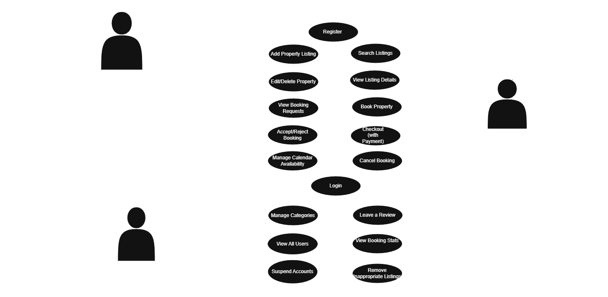

# Requirement Analysis in Software Development
 Welcome to the **Requirement Analysis** repository. This space is dedicated to understanding and documenting the foundational step in the software development life cycle-**requirement analysis**.

## 🎯 Purpose
This repository serves as a learning and documentation hub for exploring:
- The importance of gathering and analyzing requirements
- Types of requirements (functional, non-functional, etc.)
- Techniques and tools used in requirement analysis
- Real-world examples and use cases

Whether you're a student, developer, or project manager, this resource aims to provide clarity and structure around one of the most critical aspects of building successful software.

Feel free to contribute, raise issues, or fork this project to build upon it.

## 📘 What is Requirement Analysis?

**Requirement Analysis** is a critical phase in the Software Development Life Cycle (SDLC) where the goals, expectations, and constraints of a software project are identified, gathered, examined, and documented. It serves as the bridge between stakeholders (such as clients, users, business analysts) and the development team.

This process ensures that everyone involved has a clear, shared understanding of what the software system is supposed to do and how it should behave under different conditions.

---

### 🧠 Why is Requirement Analysis Important?

Requirement Analysis lays the foundation for all subsequent phases of development. Without it, projects risk failure due to misunderstandings, scope creep, misaligned objectives, or unmet user needs.

Here’s why it matters:

- ✅ **Clarity of Vision**: It captures exactly what needs to be built.
- 🧭 **Direction for Development**: It provides developers with a precise roadmap.
- 🔄 **Efficient Resource Use**: Prevents unnecessary rework and miscommunication.
- 📊 **Basis for Testing**: Requirements are used to define test cases and validation criteria.
- 🤝 **Client Satisfaction**: Ensures that the final product aligns with user expectations.

---

### 🔁 Where It Fits in the SDLC

Requirement Analysis is usually the **second phase** of the SDLC, following the **Feasibility Study**, and preceding **System Design**. The process typically includes:

1. **Requirement Gathering** – via interviews, surveys, or observations.
2. **Requirement Documentation** – clearly outlining functional and non-functional needs.
3. **Validation** – ensuring the documented requirements are complete, feasible, and verifiable.
4. **Sign-off** – stakeholders agree on the finalized requirements.

---

### 🧰 Techniques Used

- User Interviews
- Use Case Diagrams
- User Stories
- Prototyping
- Brainstorming Sessions
- MoSCoW Prioritization

---

In short, **Requirement Analysis** is not just a phase—it's the compass that guides the entire development journey. A well-executed analysis saves time, minimizes risks, and elevates software quality.

---
## 🚀 Why is Requirement Analysis Important?

Requirement Analysis is one of the most vital steps in the Software Development Life Cycle (SDLC). It is the compass that ensures the project is built in the right direction, for the right reasons, and with the right features.

Here are three key reasons why it is critical:

---

### 1. ✅ Prevents Miscommunication and Misalignment

Requirement analysis ensures that both developers and stakeholders have a shared understanding of the project goals. Without this step, misunderstandings may lead to a product that doesn’t meet user expectations or business needs.

> **Example**: If a login feature is requested but it's unclear whether it should use email, username, or phone number, the development team might choose the wrong path.

---

### 2. 🎯 Helps Define Scope and Avoid Scope Creep

A clear set of requirements establishes boundaries for what will and won’t be included in the project. This minimizes scope creep—where new features are added without proper planning or stakeholder approval.

> **Benefit**: Saves time, budget, and effort by avoiding unnecessary or last-minute changes.

---

### 3. 💡 Serves as a Foundation for Design, Testing, and Validation

Requirements serve as a reference for system design, architecture, and test case creation. Every test plan, wireframe, or technical implementation begins with understanding the requirements.

> **Impact**: Ensures that all components of the software are aligned with user needs and that testing is meaningful and measurable.

---

By highlighting user needs, clarifying project expectations, and guiding the technical roadmap, **Requirement Analysis** helps turn great ideas into successful, sust

---

## 🛠️ Key Activities in Requirement Analysis

Requirement Analysis involves several interconnected activities that help transform vague ideas into clear, actionable requirements. These activities ensure that the final software product meets both user needs and technical feasibility.

Here are the five key activities involved:

---

- **📥 Requirement Gathering**
  - Focuses on collecting raw information from stakeholders, users, and clients.
  - Involves interviews, surveys, observations, meetings, and feedback sessions.
  - The goal is to capture what the stakeholders need and expect from the system.

---

- **🧠 Requirement Elicitation**
  - Goes deeper than gathering by drawing out implicit, unspoken, or hidden requirements.
  - Uses techniques like brainstorming, workshops, role-playing, and prototyping.
  - Helps uncover assumptions, clarify vague statements, and bring clarity to user intentions.

---

- **📝 Requirement Documentation**
  - Converts gathered and elicited requirements into formal, structured documentation.
  - Common outputs include Software Requirement Specifications (SRS), user stories, or use case diagrams.
  - Ensures requirements are clear, consistent, and traceable.

---

- **📊 Requirement Analysis and Modeling**
  - Involves examining and organizing requirements to identify gaps, conflicts, or dependencies.
  - Uses models like data flow diagrams (DFDs), entity-relationship diagrams (ERDs), or UML.
  - Helps visualize the system and refine requirements for feasibility and design readiness.

---

- **✅ Requirement Validation**
  - Ensures the documented requirements accurately reflect user needs and business goals.
  - Activities include reviews, walkthroughs, inspections, and requirement testing.
  - Finalized requirements are signed off by stakeholders to proceed with system design.

---

Each of these activities plays a vital role in shaping a successful software solution. Skipping or rushing any of them can result in costly rework, user dissatisfaction, or project failure.
---

## 📂 Types of Requirements

In software development, requirements are typically divided into two major categories: **Functional** and **Non-functional**. Both are essential in defining what the system does and how it behaves under various conditions.

Below is a breakdown of each type with examples relevant to a **Booking Management Project**.

---

### 🛠️ Functional Requirements

Functional requirements describe **what** the system should do. They define the specific behaviors, functions, and features that must be implemented.

#### 📌 Examples for the Booking Management Project:

- Users shall be able to **create an account** using email and password.
- The system shall allow users to **search for available listings** based on location and date.
- Guests shall be able to **book a property** for a specific period.
- Hosts shall be able to **add, edit, or delete their property listings**.
- The system shall **send booking confirmation emails** to both guest and host after a reservation is made.
- Users shall be able to **cancel a booking** under specified conditions.
- Admins shall be able to **view and manage all bookings** from a dashboard.

---

### ⚙️ Non-functional Requirements

Non-functional requirements define **how** the system performs its functions. These relate to quality attributes such as performance, security, reliability, and usability.

#### 📌 Examples for the Booking Management Project:

- The system should respond to user queries (e.g., search results) **within 2 seconds**.
- The website shall be **accessible on both desktop and mobile devices**.
- User passwords shall be **encrypted** before being stored in the database.
- The system shall maintain **99.9% uptime** to ensure availability during peak travel periods.
- The platform shall **support up to 5,000 concurrent users** without performance degradation.
- The system must log out users **after 15 minutes of inactivity** for security.
- The application interface shall be **user-friendly and follow modern UI/UX principles**.

---

Understanding the distinction between functional and non-functional requirements ensures that both user expectations and system quality standards are properly met. Together, they form the backbone of a reliable, efficient, and user-centered software system.

---

## 🗂️ Use Case Diagrams

**Use Case Diagrams** are a visual modeling tool used in requirement analysis to describe the functional interactions between users (actors) and the system. These diagrams help clarify what the system is expected to do from the user’s perspective and are especially useful for identifying features and workflows early in development.

---

### 🎯 Benefits of Use Case Diagrams

- ✅ Provide a high-level overview of the system’s functionality
- 👤 Identify all user roles (actors) interacting with the system
- 🔍 Clarify relationships between users and specific actions
- 🧠 Enhance communication among developers, designers, and stakeholders

---

### 🏨 Use Case Diagram: Booking System

Below is a use case diagram for a **Booking Management System**:

#### 👥 Actors:
- Guest
- Host
- Admin

#### 🎬 Use Cases:
- Register/Login
- Search Listings
- View Listing Details
- Book Property
- Cancel Booking
- Add/Edit/Delete Listing (Host)
- View All Bookings (Admin)

---

## ✅ Acceptance Criteria

**Acceptance Criteria** are specific, measurable conditions that a software feature must satisfy to be considered complete and acceptable by stakeholders. They are defined during requirement analysis to set clear expectations between clients, developers, and testers.

Acceptance criteria are written **before development begins** and serve as a reference for:
- Developers (to implement correctly)
- Testers (to verify functionality)
- Product Owners (to confirm delivery meets user needs)

---

### 🎯 Importance of Acceptance Criteria in Requirement Analysis

- 🔍 **Clarifies Requirements**: Removes ambiguity by detailing what success looks like for each feature.
- 🧪 **Enables Testability**: Provides a checklist for validation and quality assurance.
- 🤝 **Aligns Expectations**: Ensures all stakeholders agree on the scope and behavior of a feature.
- 📈 **Improves Planning**: Helps in estimating effort and setting realistic development goals.

---

### 🛒 Example: Checkout Feature – Booking Management System

**Feature**: Checkout for booking a property

**Acceptance Criteria**:

1. ✅ The user must be logged in to access the checkout page.
2. ✅ The selected listing details (property name, price, dates) must be prefilled on the checkout form.
3. ✅ The user must be able to select a payment method (credit/debit card, PayPal).
4. ✅ The system must validate the payment form before submission.
5. ✅ Upon successful payment, the user should see a booking confirmation message.
6. ✅ The system must send a confirmation email to both the user and the host.
7. ✅ The booking status must be updated in the user’s dashboard as “Confirmed.”
8. ✅ If the payment fails, the system should show an error and allow retry.

---

By defining strong and clear acceptance criteria like this, development becomes focused, testing becomes efficient, and the final product closely aligns with stakeholder expectations.

